# Лабораторная №2

## Описание

В качестве структуры данных было выбрано шаровое дерево (или ball tree).
Почитать можно [тут](https://habr.com/ru/articles/575130/).
Одна из сфер, где
часто применяется дерево - это поиск ближайших k-соседей. Это дерево
можно выбрать как реализацию для [KNeighborsClassifier](http://scikit-learn.org/stable/modules/generated/sklearn.neighbors.KNeighborsClassifier.html).

Дерево принимает на вход двумерный массив данных. Сами данные берутся из 
популярного сета данных `fashion-mnist`. Размерность данных - $784$.

## Как запускать

Для запуска бенчмарков нужно в папке `lab-2` выполнить следующую команду:
```shell
mvn clean package
java -jar target/benchmarks.jar TreeKnnBenchmark
java -jar target/benchmarks.jar BallTreeBuilderBenchmark
java -jar target/benchmarks.jar BallTreeBuilderV2Benchmark
```

Для тестов запустить:
```shell
mvn test
```

## Первая реализация

Первая реализация заключается в обычной имплементации структуры данных.
По следам первой лабораторной сразу использовалась библиотека fast utils. Есть
подозрения, что без использования этой библиотеки, результаты бенчамарка были бы
еще грустнее.

Сначала был бенчмарк с замером времени получения k ближайших соседей:

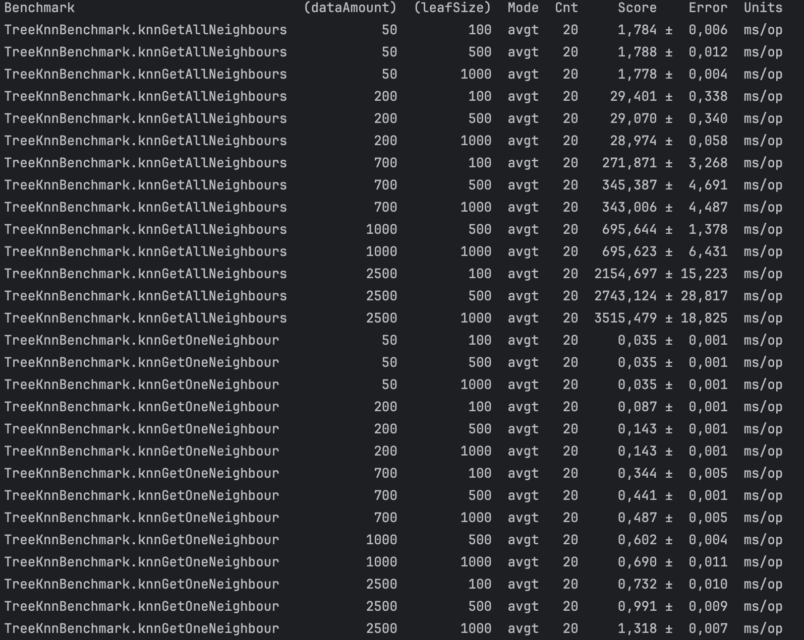

Изменяемыми параметрами был размер данных и размер листов, в которых хранятся вектора. Видно, что
размер листьев играет большое значение. На небольших размерах данных следует подбирать
размер листьев близким к размеру входящих данных. Но, это видно на последнем бенче, большой размер листа
также может и стрельнуть в ногу. Тут лучше выбирать что-то среднее, либо калибровать.

Теперь бенч по построению дерева:

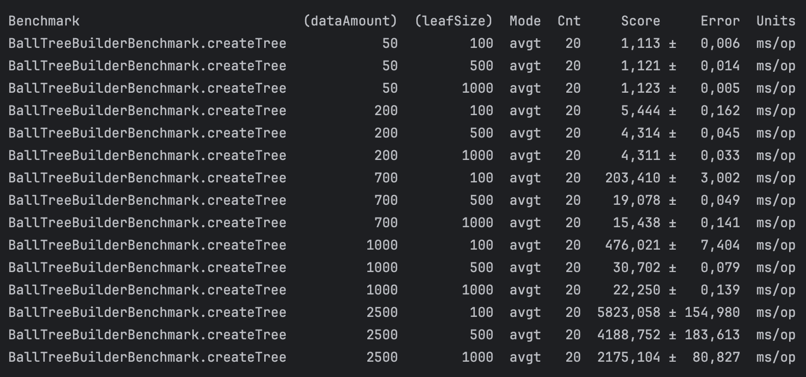

Что сразу бросается в глаза - на $2500$ строк данных (каждый объект представляет собой $784$ свойства)
видно, что время создания резко возросло. Конечно, между $1000$ и $2500$ разница больше,
чем между $1000$ и $700$, но немного напрягает. Где-то есть место, которое можно улучшить.

Давайте посмотрим профиль по времени ЦПУ:


Здесь видно, что у нас очень много рекурсии. Это правда, для построения дерева
нам нужно в зависимости от того, достигли ли мы лимита по одному листу, разбивать лист на 
поддеревья. Из-за этого возникает рекурсия. Что у нас по памяти?

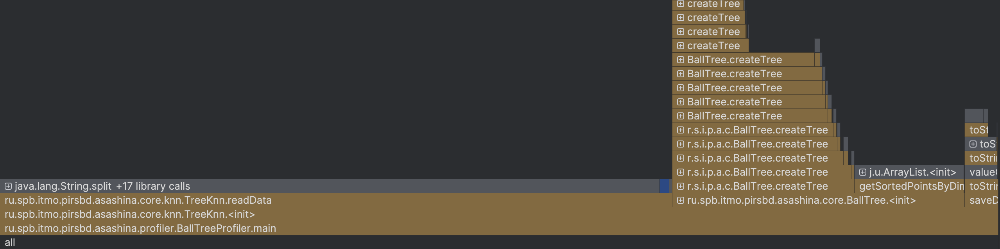

Около $509$ Мб уходит на метод `readData`, который отвечает за чтение данных из файла. В
принципе логично. Давайте смотреть что происходит по методам.

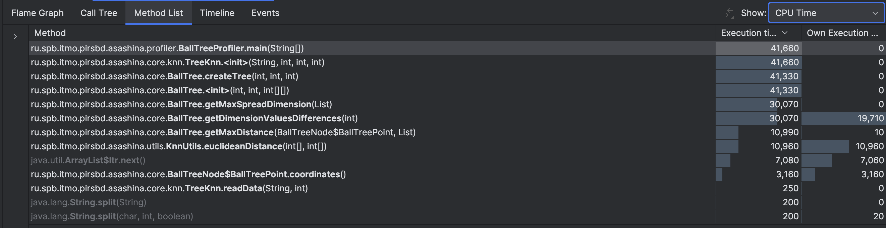

Есть два метода, которые выполняются достаточно долго по отдельности: `getDimensionValuesDifferences`
и подсчет Евклидова расстояния. Что насчет памяти?

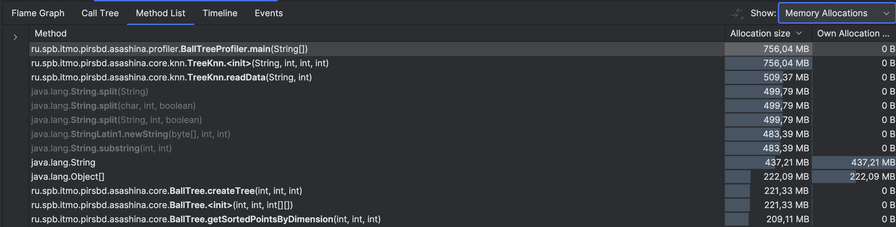

В принципе выглядит ожидаемо. Давайте посмотрим, что можно оптимизировать

## Вторая реализация

Было изменено несколько вещей:
1) `Math.pow(_, 2)` работает медленнее, чем обычное умножение число на себя, поэтому от этого метода отказалсь;
2) В Евклидовом расстоянии в конце берется корень от разницы квадратов координат. Однако, для сравнения расстояния в ближайших соседях этого делать необязательно;
3) Можно `points` хранить в массиве, т.к. мы знаем изначально количество элементов.

На самом деле была еще попытка оптимизации чтения/записи, но про нее ниже.
Давайте посмотрим, что стало с флеймграфом:

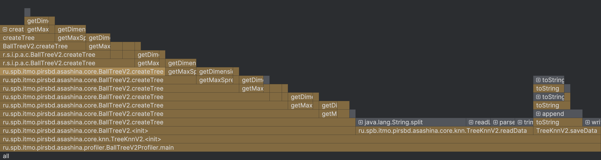
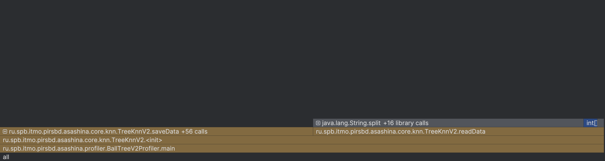

Раньше вызов самого первого `createTree` занимал почти $2$ секунды, а стал $0,58$. А вот по памяти как будто немного поплохело.

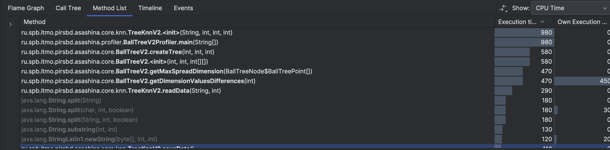
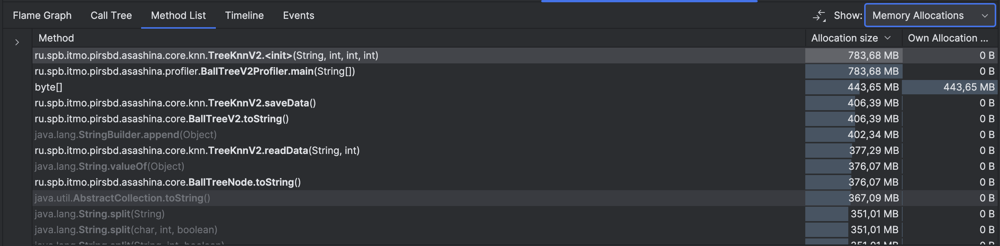

Да, по памяти есть ухудшение, потому что мы теперь храним расстояние без взятия корня.
Однако время у нас сильно сократилось. Финальные бенчи:

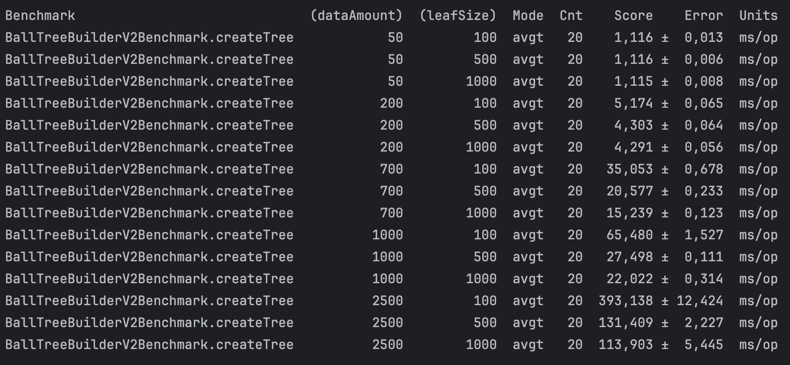

Видно, что особенно на больших данных время операций сократилось.

## Дополнительно (реализация 2,5)

Я еще попробовала во второй версии использовать `NIO`. Результат
профилирования от предыдущей практически не отличается по времени. По
памяти да, но потому что мы читаем в буфер, потом отгружаем в класс.

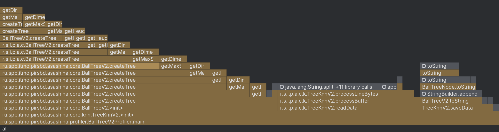
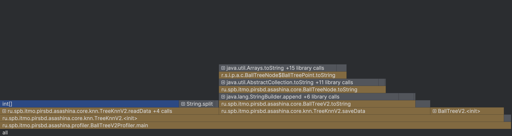
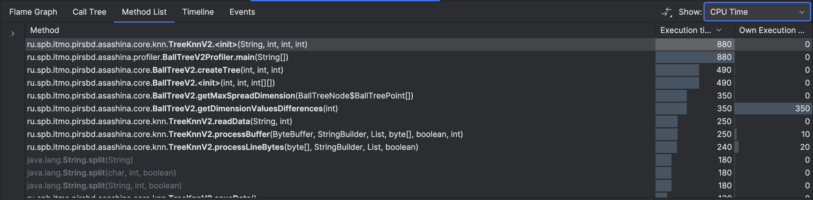
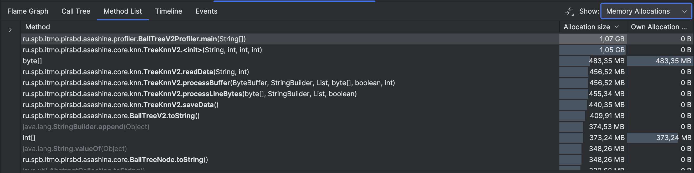

По времени есть немного выигрыш, но посмотрим на бенч:

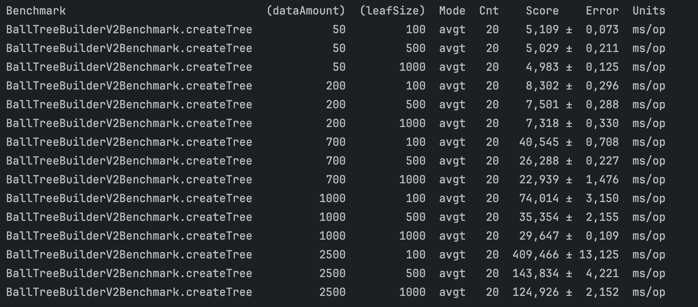

Видно, что по операциям мы сильно проседаем. Однако, в конце результат со второй
реализацией практически сравнялся. Есть подозрение, что чтение/запись v2 лучше использовать на
больших данных, а не на тех, которые были выше.